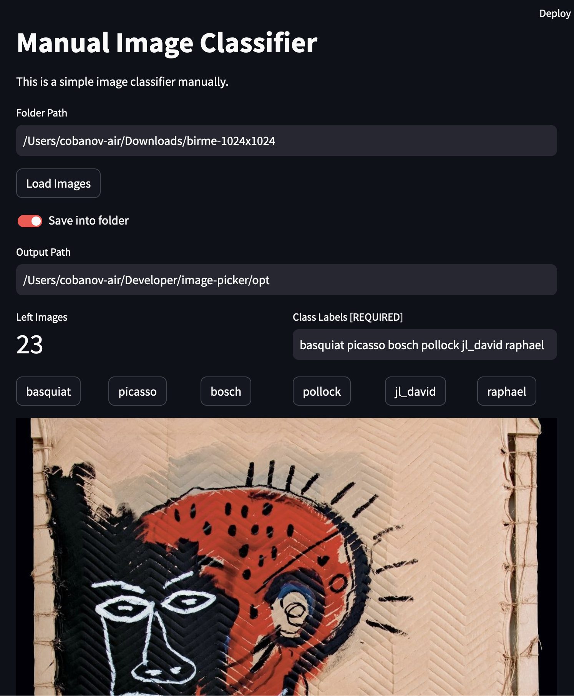

# Image Picker / Manual Image Classifier

This project allows users to manually select images and classify them into user defined categories. Selected images are saved in corresponding folders based on the chosen class.

## Requirements

* Python 3.x
* Streamlit (`pip install streamlit`)
* Pillow (`pip install pillow`)

## How to Use

1. Clone this repository or download the files.
2. Open a terminal in the project directory.
3. Run the application: `streamlit run classifier.py`

## Disclaimer

This project provides a basic framework for manual image classification. It might require further development depending on your specific use case and desired functionalities.

## Contributing

Contributions to this project are welcome. Please ensure that your code adheres to the project's coding standards and include appropriate unit tests where applicable.

## License

This project is licensed under the MIT License - see the LICENSE file for details.
